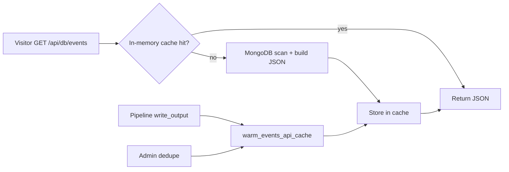

# Events list caching

The public home page loads events via `GET /api/<db>/events`. That endpoint scans MongoDB for every row in the **30-day display window** (`API_EVENT_WINDOW_DAYS`), joins venue locations, and builds camelCase JSON. Without caching, **every new visitor** (and every hard refresh) repeats that work.

The Angular app already keeps an **in-browser cache** (`EventsStore`) so tag/venue filter clicks do not refetch. Task 15 adds a **server-side cache** so the API itself does not hit MongoDB on every first visit.

---

## Options considered

| Option | How it works | Pros | Cons | Verdict |
|--------|----------------|------|------|---------|
| **1. In-process API cache (implemented)** | Python dict keyed by `(db, window_start, window_end)`; warmed after each pipeline run | Simple, no new infra, big win for single API process, auto-expires when the calendar day changes | Lost on API restart until next pipeline run; not shared across multiple API workers | **Chosen** |
| **2. HTTP `Cache-Control` / ETag** | Browser or CDN caches the JSON response | Offloads traffic entirely when cache hits | Frontend currently busts cache with `?t=…`; stale until TTL; harder to invalidate precisely after a pipeline run | Complement only |
| **3. MongoDB snapshot document** | Store pre-built JSON in e.g. `events_list_cache` collection | Survives API restarts; one document per topic | Extra write on every run; still one read per request (lighter than full scan) | Good if API runs many replicas |
| **4. Redis / Memcached** | External key/value store | Shared across workers; fast | New dependency, ops overhead | Overkill for current scale |
| **5. CDN / reverse-proxy cache** | nginx `proxy_cache` in front of `/api/.../events` | Scales to high traffic | Needs cache purge hook after pipeline; same stale-window issues as (2) | Production add-on later |
| **6. Client-only (status quo before Task 15)** | `EventsStore` in Angular | Instant filter UX within one tab session | Every new session still hits MongoDB | Kept; not sufficient alone |

---

## What we implemented (option 1)



### Module

`src/agent/events_api_cache.py`

- **`get_events_api_payload(db, loader)`** — used by `GET /api/<db>/events` and sitemap generation.
- **`warm_events_api_cache(db, loader)`** — pre-builds JSON after data changes so the **next** visitor request is a cache hit.
- **`invalidate_events_api_cache(db)`** — drop entries for one topic (or all).

### When the cache refreshes

| Trigger | Action |
|---------|--------|
| End of `write_output()` (every scheduled / manual pipeline run) | **Warm** — one MongoDB scan right after merge, then serve from memory |
| `POST /api/admin/dedupe-events` | **Warm** after dedupe completes |
| Calendar day change in `DISPLAY_TZ` | **Automatic miss** — cache key includes today's ISO date and window end |
| API process restart | Cache empty until next warm or first visitor miss |
| `EVENTS_API_CACHE_ENABLED=false` | Bypass cache (every request hits MongoDB) |

### Configuration

```env
# Default: true. Set false to disable (debugging or A/B comparison).
EVENTS_API_CACHE_ENABLED=true
```

---

## What is *not* cached

These endpoints still query MongoDB each time (by design):

- `POST /api/<db>/events/search` — query-specific
- `GET /api/<db>/events/spotlight` — random selection
- Admin venue/user/comment APIs

---

## Frontend note

`EventsStore` (`web/src/app/events/events-store.service.ts`) still loads once per browser tab and filters client-side. Server caching reduces load when **many users** open the site between pipeline runs; the browser cache reduces load when **one user** clicks tags/venues.

To allow browser caching later, remove the `?t=${Date.now()}` cache-buster in `EventsStore.load()` and add `Cache-Control` + `ETag` headers on the API response — option 2 above.

---

## Key files

| Area | Path |
|------|------|
| Cache module | `src/agent/events_api_cache.py` |
| API handler | `src/agent/api.py` → `get_events`, `get_sitemap_xml` |
| Warm after pipeline | `src/agent/local_output.py` → `write_output` |
| MongoDB loader | `src/agent/event_store.py` → `load_events_api_payload` |
| Display window | `src/agent/event_window.py` → `api_window_iso_bounds` |
| Browser cache | `web/src/app/events/events-store.service.ts` |
| Tests | `tests/test_events_api_cache.py` |
