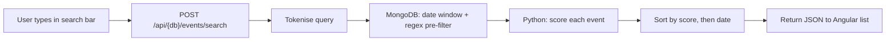

# Event search

Task 17 (`docs/tasks/17.md`): replace the slow LLM-based search bar with a fast database-only text search over the `events` collection.

The home page search bar (`web/src/app/list/list.ts`) posts to `POST /api/{db}/events/search` with `{ "query": "..." }`. The term is also bookmarkable via `?search=` in the URL. Implementation lives in `src/agent/event_search.py`.

## What it does (and does not do)

- **Does:** search upcoming events in MongoDB within the same **30-day display window** as `GET /api/{db}/events` (configured by `API_EVENT_WINDOW_DAYS`).
- **Does:** match on similarity — search terms do not need to match exactly.
- **Does not:** call an LLM. No OpenAI or Ollama configuration is required for search to work.
- **Does not:** search `location` (suburb/city). Only the four fields listed below are considered.

## Fields searched

| MongoDB field | Example |
|---------------|---------|
| `event` | `"Classical Quartet"` |
| `summary` | `"Chamber music evening"` |
| `tags` | `["jazz", "free"]` |
| `venue.name` | `"The Triffid"` |

These are concatenated into one lowercase string per event before scoring.

## How matching works

### 1. Tokenise the query

The user's search text is split into lowercase alphanumeric tokens. Tokens shorter than two characters are dropped (they add noise without much benefit).

Example: `"DJ sets on the Gold Coast"` → `dj`, `sets`, `on`, `the`, `gold`, `coast`.

### 2. Pre-filter in MongoDB

Before scoring, MongoDB narrows the candidate set:

- **Date window** — same ISO date range as the public event list.
- **Regex pre-filter** — at least one token must appear (case-insensitive) in `event`, `summary`, `tags`, or `venue.name`.

Events without a valid `http(s)` URL are skipped (same rule as the main list).

### 3. Score in Python

Each surviving event is scored against every query token. A token does not need to match a whole word exactly.

| Match type | Weight | Example |
|------------|--------|---------|
| Substring in the combined text | `term length × 2.0` | `"classical"` inside `"Classical Quartet"` |
| Word prefix (either direction) | `term length × 1.5` | `"jazz"` matching `"jazznight"` |
| Word contains / partial overlap | `term length × 1.0` | softer partial matches |

- Events with **zero** matching tokens are excluded.
- Events matching **all** tokens receive a **1.25× bonus** so better matches rank higher.
- Results are sorted by score (descending), then by event date (ascending).

### 4. Return API-shaped JSON

Matched documents are converted to the same camelCase event objects as `GET /api/{db}/events` (including `isoDate`, `thumbnailUrl`, tags, etc.).

Response shape:

```json
{
  "generated": "<ISO timestamp>",
  "events": [ /* matched rows, best first */ ],
  "searchQuery": "classical chamber"
}
```

## End-to-end flow



## Front end

- Search icon: 🔍 (not an LLM/AI indicator).
- Active search is shown as `Search: "…"` with a match count.
- Results combine with tag and venue filters already on the page (venue/tag filters take precedence in the URL; starting a search clears tag/venue route segments).
- Error message: *"Search could not complete — try again shortly."*

## Why this design

For a month of gigs (typically hundreds of rows, not millions), **pre-filter in the database, rank in application code** is fast and simple:

- MongoDB does the cheap narrowing with the date index and regex.
- Python does flexible similarity scoring that would be awkward to express purely in a MongoDB query.
- Works with the in-memory test database (mongomock) — no Atlas Search or text-index setup required.

If the event volume grew much larger, the next step would be a dedicated full-text index (MongoDB Atlas Search or similar). At current scale this approach is the right balance of speed, simplicity, and recall.

## Key files

| Area | Path |
|------|------|
| Search logic | `src/agent/event_search.py` |
| API route | `src/agent/api.py` → `post_events_search` |
| Angular search bar | `web/src/app/list/list.ts`, `list.html` |
| Tests | `tests/test_event_search.py` |

## Known limitation

**Location is not searched.** A query like `"Brisbane classical"` only matches if `"Brisbane"` appears in `event`, `summary`, `tags`, or `venue.name` — not in the venue's suburb field (`location`), which lives on the venue record and is shown in the UI but excluded from search. Adding `location` would be a small follow-up if needed.
